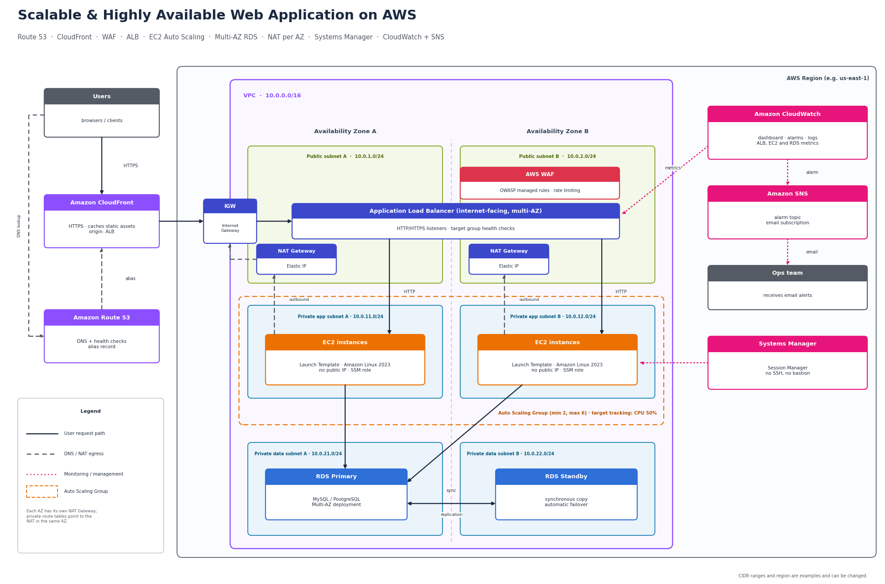

# Scalable & Highly Available Web Application on AWS

**Author:** `<your name>`  
**Program:** AWS Solutions Architect – Associate graduation project (Manara)  
**Project idea:** Scalable Web Application with ALB and Auto Scaling (EC2-based)  
**Live demo / video:** `<add your URL or video link here, or delete this line>`

---

## 1. Overview

This project designs and deploys a three-tier web application on AWS that keeps working when an instance or a whole Availability Zone (AZ) fails, and that scales automatically with traffic.

Requests enter through **CloudFront** and reach an internet-facing **Application Load Balancer** protected by **AWS WAF**. The web servers run in an **Auto Scaling Group** in **private subnets** across two AZs. Data lives in a **Multi-AZ RDS** database in isolated data subnets. Instances reach the internet only through **NAT Gateways** and are managed through **Systems Manager Session Manager**, so there are no public IPs, no SSH keys and no bastion host. **CloudWatch** and **SNS** provide monitoring and email alerts.

### Design goals

| Goal | How it is met |
|---|---|
| High availability | Two AZs, ALB health checks, ASG self-healing, RDS Multi-AZ, one NAT Gateway per AZ |
| Scalability | Auto Scaling with a target tracking policy, CloudFront caching for static content |
| Security | Private subnets, layered security groups, NACLs, WAF, no SSH, encrypted storage |
| Operational visibility | CloudWatch dashboard and alarms, SNS email notifications, Route 53 health check |
| Low latency | CloudFront edge caching in front of the ALB |

---

## 2. Architecture diagram



### Request flow

1. A user resolves the site name through **Route 53**, which returns the **CloudFront** distribution (alias record).
2. CloudFront serves cached static content from the edge and forwards everything else over HTTPS to the **ALB**.
3. The ALB (with **WAF** attached) checks the request against the OWASP managed rules and rate limits, then forwards it to a healthy EC2 instance in either AZ.
4. The EC2 instance handles the request and talks to the **RDS primary** on the database port.
5. RDS synchronously replicates every committed write to the **standby** in the other AZ.
6. Instances reach the internet (package updates, SSM endpoints) through the NAT Gateway in their own AZ.

---

## 3. Components

| Layer | Service | Configuration |
|---|---|---|
| DNS | Route 53 | Alias record to CloudFront; health check on the public endpoint |
| Edge | CloudFront | Origin is the ALB; HTTPS only; cache behavior for static paths (e.g. `/static/*`) |
| Edge security | AWS WAF | Web ACL on the ALB with the AWS managed core rule set and a rate-based rule |
| Load balancing | Application Load Balancer | Internet-facing, in both public subnets, HTTP/HTTPS listeners, health check on `/` |
| Compute | EC2 + Auto Scaling Group | Launch Template, both private app subnets, min 2 / desired 2 / max 6, ELB health checks |
| Database | RDS (MySQL or PostgreSQL) | Multi-AZ instance deployment, encrypted at rest, in private data subnets |
| Egress | NAT Gateway (x2) | One per AZ, each with its own Elastic IP |
| Access | Systems Manager Session Manager | Instance profile with `AmazonSSMManagedInstanceCore` |
| Monitoring | CloudWatch | Dashboard plus alarms |
| Notifications | SNS | Topic with an email subscription for the operations team |

---

## 4. Network design

**VPC:** `10.0.0.0/16`, spanning two AZs. The CIDR ranges below are examples.

| Tier | AZ A | AZ B | Contains |
|---|---|---|---|
| Public | `10.0.1.0/24` | `10.0.2.0/24` | ALB, NAT Gateways |
| Private app | `10.0.11.0/24` | `10.0.12.0/24` | EC2 instances (ASG) |
| Private data | `10.0.21.0/24` | `10.0.22.0/24` | RDS primary and standby |

### Route tables

| Route table | Routes |
|---|---|
| Public (shared by both public subnets) | `10.0.0.0/16` local, `0.0.0.0/0` to Internet Gateway |
| Private app A | `10.0.0.0/16` local, `0.0.0.0/0` to NAT Gateway in AZ A |
| Private app B | `10.0.0.0/16` local, `0.0.0.0/0` to NAT Gateway in AZ B |
| Private data | `10.0.0.0/16` local only (no internet route) |

Each private app subnet uses the NAT Gateway in its own AZ. If one AZ fails, the other AZ's outbound path is not affected, and there is no cross-AZ NAT dependency.

---

## 5. Security

### Security groups (stateful, the primary control)

| Security group | Inbound | Source |
|---|---|---|
| `alb-sg` | TCP 80/443 | CloudFront origin-facing managed prefix list |
| `web-sg` (EC2) | TCP 80 (app port) | `alb-sg` only |
| `db-sg` (RDS) | TCP 3306 (MySQL) or 5432 (PostgreSQL) | `web-sg` only |

Restricting the ALB to the CloudFront prefix list means users cannot bypass CloudFront and WAF by hitting the ALB directly.

### Network ACLs (stateless, a second layer)

NACLs are stateless, so return traffic on ephemeral ports (1024–65535) must be allowed explicitly.

| Subnet tier | Inbound | Outbound |
|---|---|---|
| Public | 80/443 from the internet; ephemeral from the internet | 80 to private app subnets; 80/443 and ephemeral to the internet |
| Private app | 80 from public subnets; ephemeral from the internet (NAT return traffic) | DB port to data subnets; 443 to the internet; ephemeral to public subnets |
| Private data | DB port from private app subnets | Ephemeral to private app subnets |

### Other controls

- **No SSH and no public IPs.** Administrators connect with Session Manager, which is logged and controlled by IAM.
- **IMDSv2 required** in the Launch Template.
- **Encryption at rest** for EBS volumes and the RDS instance (KMS), and **HTTPS** between viewers and CloudFront.
- **WAF** with the AWS managed core rule set (OWASP Top 10 style protections) and a rate-based rule. AWS Shield Standard is included automatically with CloudFront and Route 53.
- **Least privilege IAM:** the instance role has only the SSM managed policy plus whatever the application needs.

> If you use a custom domain, request the certificate in AWS Certificate Manager. Certificates used by CloudFront must be in `us-east-1`; certificates used by the ALB must be in the ALB's region.

---

## 6. High availability and scalability

### Failure scenarios

| Failure | What happens |
|---|---|
| An EC2 instance crashes or fails health checks | The ALB stops routing to it and the ASG replaces it |
| A whole AZ becomes unavailable | The ALB keeps sending traffic to the healthy AZ, the ASG launches replacements there, and RDS fails over to the standby (typically 1–2 minutes) |
| The RDS primary fails | RDS promotes the standby and updates the DNS endpoint automatically; the application reconnects |
| A NAT Gateway fails | Only outbound traffic from that AZ is affected; the other AZ is unchanged |
| Traffic spike | Target tracking adds instances up to the maximum, and CloudFront absorbs repeat requests for static content |
| Common web attacks or request floods | WAF rules block or rate limit them before they reach the instances |

### Auto Scaling

- **Policy:** target tracking on `ASGAverageCPUUtilization` at **50%**. Request count per target (`ALBRequestCountPerTarget`) is a reasonable alternative or addition.
- **Capacity:** minimum 2 (one per AZ), maximum 6.
- **Health checks:** ELB type with a warm-up (grace) period so new instances are not replaced before the app starts.

### RDS Multi-AZ

RDS keeps a standby in a second AZ and replicates to it **synchronously**, so committed data is not lost during failover. The standby is for availability only and does not serve read traffic. Read scaling would need read replicas, which are outside the scope of this project.

---

## 7. Monitoring and alerts

| Alarm | Metric | Threshold (example) |
|---|---|---|
| High CPU on web tier | `CPUUtilization` (ASG average) | > 80% for 5 minutes |
| Unhealthy targets | `UnHealthyHostCount` (ALB target group) | >= 1 for 2 minutes |
| Server errors | `HTTPCode_Target_5XX_Count` / `HTTPCode_ELB_5XX_Count` | above a small baseline |
| Database storage | `FreeStorageSpace` (RDS) | below 20% of allocated storage |
| Database CPU | `CPUUtilization` (RDS) | > 80% for 5 minutes |
| Endpoint down | Route 53 health check status | unhealthy |

All alarms publish to one SNS topic with an email subscription. The subscription must be confirmed from the email that SNS sends. Route 53 health check metrics are published in `us-east-1`, so create that alarm (and an SNS topic) there.

A CloudWatch dashboard shows ALB request count and latency, ASG instance count, EC2 CPU and RDS connections in one view.

---

## 8. Implementation steps

1. **VPC:** create the VPC, six subnets, the Internet Gateway, and the route tables described in section 4.
2. **NAT Gateways:** create one per public subnet with an Elastic IP, then point each private app route table to the NAT in its own AZ.
3. **Security groups and NACLs:** create `alb-sg`, `web-sg` and `db-sg`, then the NACLs in section 5.
4. **RDS:** create a DB subnet group from the two data subnets and launch the database with Multi-AZ and encryption enabled, attached to `db-sg`.
5. **IAM:** create an instance role with `AmazonSSMManagedInstanceCore`.
6. **Launch Template:** Amazon Linux 2023, the instance profile, `web-sg`, IMDSv2 required, and the user data script below.
7. **ALB and target group:** create the ALB in the public subnets with `alb-sg`, plus a target group with a health check on `/`.
8. **Auto Scaling Group:** use the Launch Template across both private app subnets, attach the target group, enable ELB health checks, set min 2 / max 6 and add the CPU 50% target tracking policy.
9. **WAF:** create a web ACL with the managed core rule set and a rate-based rule, and associate it with the ALB.
10. **CloudFront:** create a distribution with the ALB as the origin, HTTPS only, and a cache behavior for static paths.
11. **Route 53 (optional, needs a domain):** create the alias record to CloudFront and a health check on the site.
12. **Monitoring:** create the SNS topic and email subscription, the alarms in section 7, and the dashboard.

### Sample user data

This installs a simple page that shows which instance and AZ served the request, which makes load balancing across AZs easy to demonstrate.

```bash
#!/bin/bash
dnf install -y httpd
systemctl enable --now httpd

TOKEN=$(curl -s -X PUT "http://169.254.169.254/latest/api/token" \
  -H "X-aws-ec2-metadata-token-ttl-seconds: 300")
INSTANCE_ID=$(curl -s -H "X-aws-ec2-metadata-token: $TOKEN" \
  http://169.254.169.254/latest/meta-data/instance-id)
AZ=$(curl -s -H "X-aws-ec2-metadata-token: $TOKEN" \
  http://169.254.169.254/latest/meta-data/placement/availability-zone)

cat > /var/www/html/index.html <<EOF
<h1>Scalable Web Application</h1>
<p>Instance: ${INSTANCE_ID}</p>
<p>Availability Zone: ${AZ}</p>
EOF
```

---

## 9. Testing and validation

Add a screenshot or short note for each test in `screenshots/`.

| Test | How | Expected result |
|---|---|---|
| Load balancing | Refresh the site repeatedly | Instance ID and AZ alternate |
| Self-healing | Terminate one instance | ASG launches a replacement; site stays up |
| Scale out | Run `stress-ng --cpu 0 --timeout 600` on an instance through Session Manager, or generate load with a tool such as `hey` | CPU alarm fires; ASG adds instances |
| Database failover | RDS action **Reboot with failover** | Standby is promoted; the site recovers after a short interruption |
| No direct ALB access | Request the ALB DNS name directly | Request is blocked (only CloudFront is allowed) |
| WAF | Send a simple SQL injection style query string | Request is blocked with a 403 |
| Alerting | Trigger an alarm | Email arrives from SNS |

---

## 10. Design decisions and trade-offs

| Decision | Reason | Trade-off |
|---|---|---|
| EC2 in private subnets behind NAT | Instances are not reachable from the internet | NAT Gateways add hourly and data processing cost |
| One NAT Gateway per AZ | No cross-AZ dependency for outbound traffic | Roughly double the NAT cost of a single shared NAT |
| Session Manager instead of a bastion | No open SSH port, no key management, full audit trail | Needs the SSM agent and outbound access to SSM endpoints |
| Target tracking scaling | Simple and self-adjusting | Less control than step scaling for unusual load patterns |
| Multi-AZ RDS (not read replicas) | Solves availability, which is the goal | Does not add read capacity |
| ALB restricted to CloudFront | Forces traffic through the edge and WAF | Direct ALB testing needs a temporary rule |

---

## 11. Well-Architected alignment

| Pillar | How the design addresses it |
|---|---|
| Reliability | Multi-AZ everywhere, health checks, automatic recovery, no single points of failure |
| Security | Private subnets, layered controls, WAF, no SSH, encryption |
| Performance efficiency | Auto Scaling, CloudFront caching |
| Cost optimization | Elastic capacity, minimum instance count of 2, cleanup after demos |
| Operational excellence | Dashboards, alarms, notifications, repeatable Launch Template |

---

## 12. Cost and cleanup

NAT Gateways, the ALB, Multi-AZ RDS and running EC2 instances all bill by the hour. After collecting screenshots and recording the demo, delete resources in this order to avoid dependency errors:

1. Auto Scaling Group (set desired capacity to 0, then delete), Launch Template
2. CloudFront distribution (disable first, then delete), WAF web ACL
3. ALB and target group
4. RDS instance (skip or delete the final snapshot as needed)
5. NAT Gateways, then release the Elastic IPs
6. Route 53 records and health checks, CloudWatch alarms and dashboard, SNS topic
7. Subnets, route tables, Internet Gateway, security groups, VPC

---

## 13. Future improvements

- Define the whole stack as code with CloudFormation, Terraform or CDK.
- Store database credentials in Secrets Manager with automatic rotation.
- Add ElastiCache or read replicas to offload database reads.
- Add a CI/CD pipeline (CodePipeline and CodeDeploy) for application releases.
- Turn on CloudTrail and centralize logs; add GuardDuty for threat detection.
- Add a cross-region disaster recovery strategy.

---

## Repository structure

```
.
├── README.md
├── architecture-diagram.png
└── screenshots/        # deployment and test evidence
```
